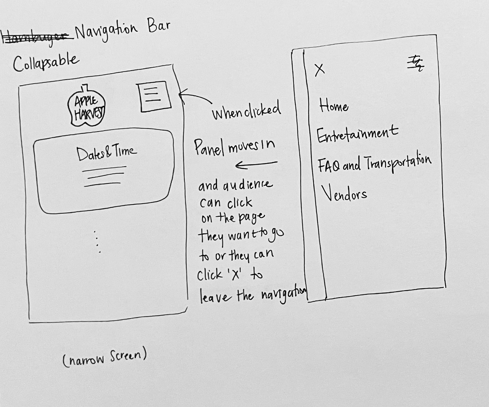
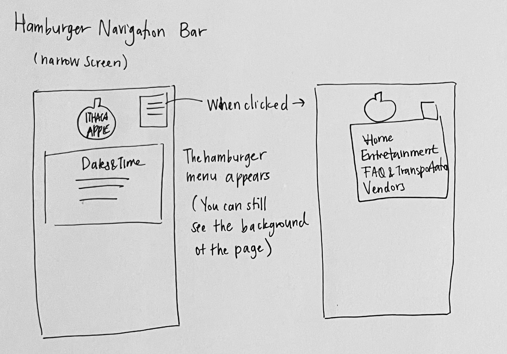
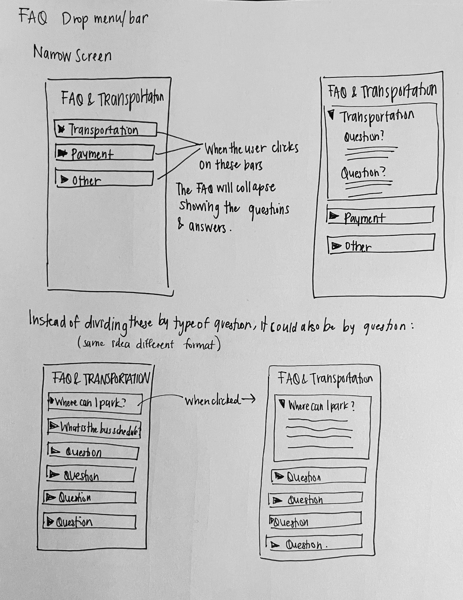
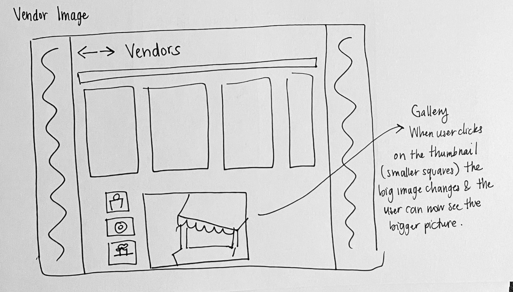
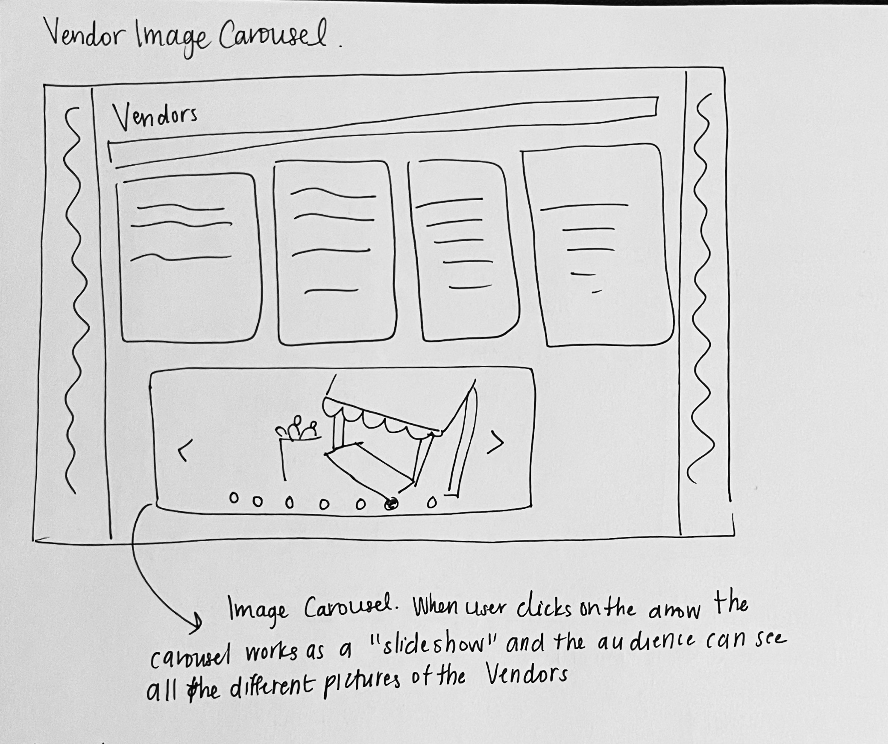
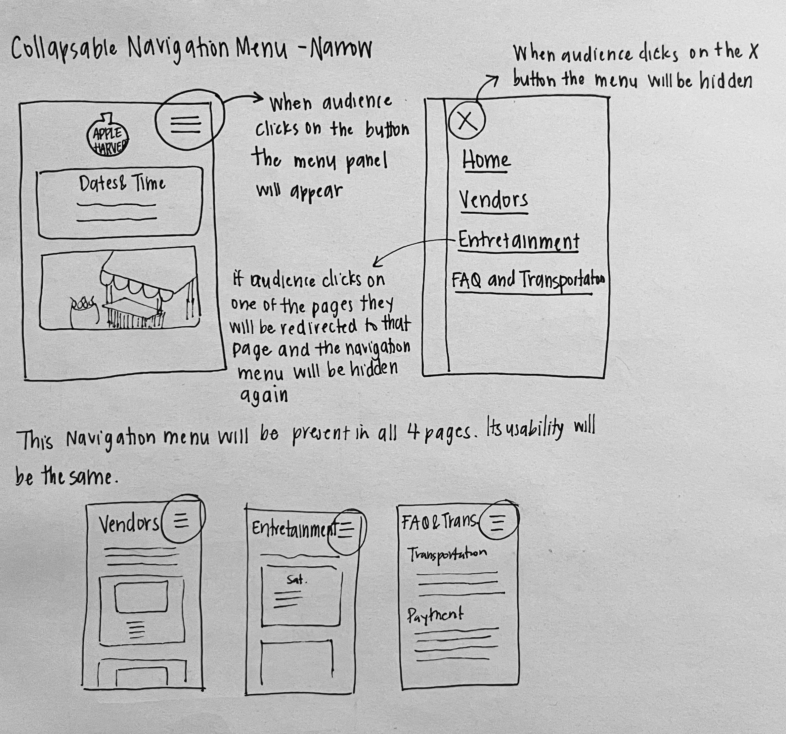
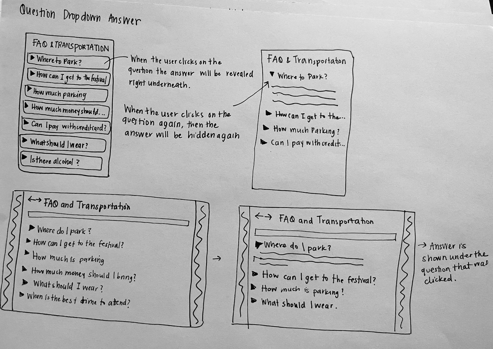
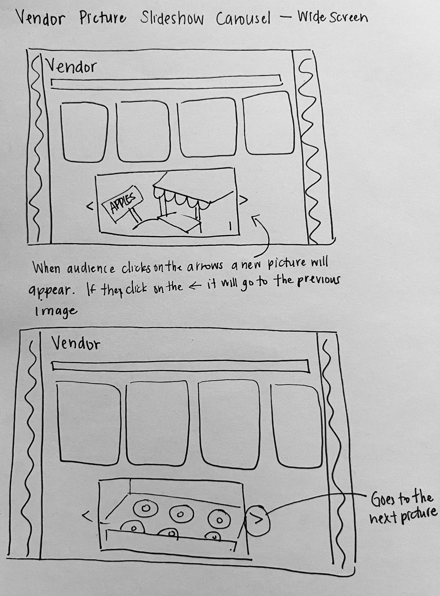
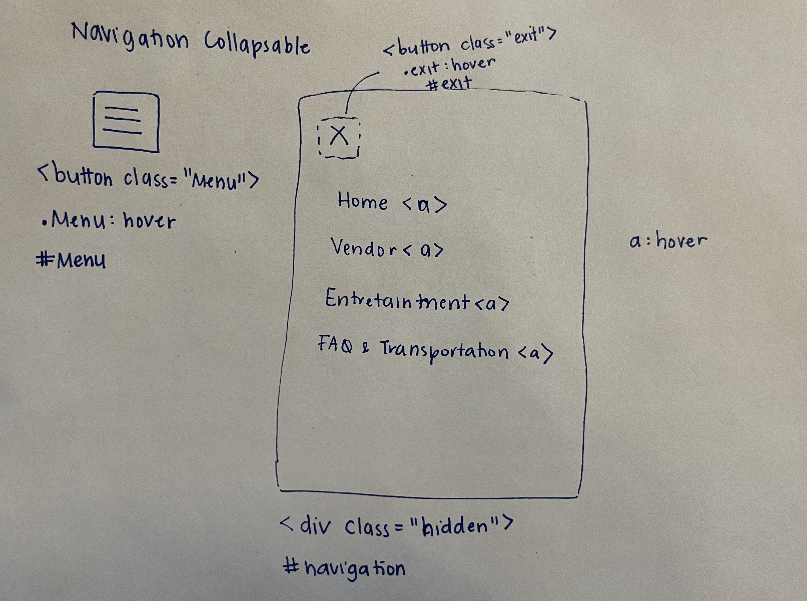
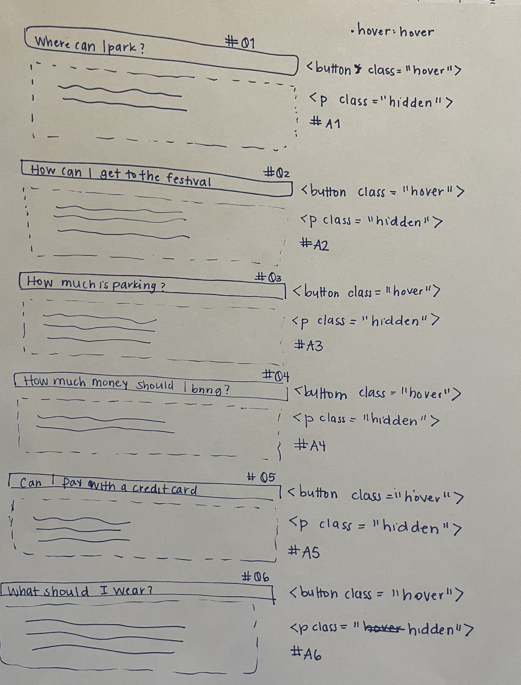

# Project 3: Design Journey

**For each milestone, complete only the sections that are labeled with that milestone.** Refine all sections before the final submission.

You are graded on your design process. If you later need to update your plan, **please do not delete the original plan, leave it in place and append your new plan _below_ the original.** Then explain why you are changing your plan. Any time you update your plan, you're documenting your design process!

**Replace ALL _TODOs_ with your work.** (There should be no TODOs in the final submission.)

Be clear and concise in your writing. Bullets points are encouraged.

**Everything, including images, must be visible in _Markdown: Open Preview_.** If it's not visible in the Markdown preview, then we can't grade it. We also can't give you partial credit either. **Please make sure your design journey should is easy to read for the grader;** in Markdown preview the question _and_ answer should have a blank line between them.


## Existing Project (Milestone 1)

**Tell us about the project you'll be using for Project 3.**

### Project (Milestone 1)
> Which project will you add interactivity to enhance the site's functionality?

Project 2


### Audience (Milestone 1)
> Briefly explain your site's audience.
> Be specific and justify why this audience is a **cohesive** group.

My sites audience are Ithaca visitors who are interested in going to the Ithaca Apple Harvest Festival.This is a cohesive group because they are people who already know about the festival, but will likely have to do some research and seek information before and during the festival. They also differ from residents or students in that they arent locals in the area and will most probably seek other types of information about other things to do in Ithaca when they visit, not just about the Festival. I think this audience is also a cohesive group because they will have similar goals of finding vendors they are interested in, exploring the local businesses, and engaging in other community activities.


### Audience's Goals (Milestone 1)
> List the audience's goals that you identified in Project 1 or 2.
> Simply list each goal. No need to include the "Design Ideas and Choices", etc.
> You may adjust the goals if necessary.

- Goal 1: Find their favorite food vendors
- Goal 2: Being able to find parking in order to enjoy the Apple Harvest Festival
- Goal 3: Explore more local vendors
- Goal 4: Learn about event activities
- Goal 5: Find information fast and easily on mobile devices


## Interactivity Design (Milestone 1)

### Interactivity Brainstorm (Milestone 1)
> Using the audience goals you identified, brainstorm possible options for interactivity to enhance the functionality of the site while also assisting the audience with their goals.
> Briefly explain each idea and provide a brief rationale for how the interactivity enhances the site's functionality for the audience.
> Note: You may find it easier to sketch for brainstorming. That's fine too. Do whatever you need to do to explore your ideas.

- Hambuger Navigation Bar in narrow screen
  - This enhances the functionality because it plays on familiar design patterns that the users will know and it takes away the need for the vertical navigation that takes a lot of space.
- Vendor Image Carousel
  - For the Project 2, I mimicked a picture carousel by having the pictutres be lined  up next to eachother, but I think adding an actual carousel allows the audience that has the goal to find new vendors to browse and look at the available shops and stands
- FAQ drop down
  - This allows users to go directly to the type of question they have and find their answer much faster


### Interactivity Design Ideation (Milestone 1)
> Explore the possible design solutions for the interactivity.
> Sketch several iterations of your interactivity.
> Annotate each sketch explaining what happens when a user takes an action. (e.g. When user clicks this, something else appears.)








### Final Interactivity Design (Milestone 1)
> Create _polished_ sketch(es) (it's still a sketch, but with a little more care taken to communicate ideas clearly to the graders) to plan your interactivity.
> **Sketch out the entire page where your interactivity will go.**
> Include your interactivity to the sketch(es).
> Add annotations to explain what happens when the user takes an action.
> Include as many sketches as necessary to communicate your design (ask yourself, could another 1300 take these sketches an implement my design?)



<!--  -->


### Interactivity Rationale (Milestone 1)
> Describe the purpose of your proposed interactivity.
> Provide a brief rationale explaining how your proposed interactivity addresses the goals of your site's audience.
> This should be about a paragraph. (3-5 sentences)

The collapsable navigation bar allows the narrow version of the page to not be taken up by the vertically stacked navigation bar. Instead, the audience can use their familiarlity of common design patterns to access the other pages by clicking on the upper right corner of the page. One of the goals for my audience is to find the information easily on mobile devices. This is important because they wont have a big screen once they arrive at the festival. This interactivity would make the website look less crowded on narrow screens, but also use familiar design patterns so that the users can still easily reach the desired information.

The collapsable FAQ section will be useful for people to find the answers to their questions fast. Without the interactivity, the page is full of text that may overwhelm users. When using an FAQ page, users may already have a question in mind and want to get to the question as fast as they can. This interactivity would allow the questions to be displayed without so much noise so that the users could directly go to the question that they need and by clicking it will show the answer.


## Interactivity Implementation Plan (Milestone 1)

### Interactivity Planning Sketches (Milestone 1)
> Produce planning sketches that include all the details another 1300 student would need to implement your interactivity design.





### Interactivity Pseudocode Plan (Milestone 1)
> Write your interactivity pseudocode plan here.
> Pseudocode is not JavaScript. Please do not put JavaScript code here.

```
when #Q1 is clicked:
  if #A1 has .hidden
    remove .hidden from #A1
  else
    add .hidden to #A1

when #Q2 is clicked:
  if #A2 has .hidden
    remove .hidden from #A2
  else
    add .hidden to #A2

when #Q3 is clicked:
  if #A3 has .hidden
    remove .hidden from #A3
  else
    add .hidden to #A3

when #Q4 is clicked:
  if #A4 has .hidden
    remove .hidden from #A4
  else
    add .hidden to #A4

when #Q4 is clicked:
  if #A4 has .hidden
    remove .hidden from #A4
  else
    add .hidden to #A4

when #Q5 is clicked:
  if #A5 has .hidden
    remove .hidden from #A5
  else
    add .hidden to #A5

when #Q6 is clicked:
  if #A6 has .hidden
    remove .hidden from #A6
  else
    add .hidden to #A6

when #Q7 is clicked:
  if #A7 has .hidden
    remove .hidden from #A7
  else
    add .hidden to #A7

when #Q8 is clicked:
  if #A8 has .hidden
    remove .hidden from #A8
  else
    add .hidden to #A8

when #exit is clicked:
  add .hidden to #navigation

when #menu is clicked:
  remove .hidden from #navigation

Revised after M1 Submission:

When Window is Resized
  if window width > 900
    remove .hidden from #navigation
    remove .navside from #navigation
    add .hidden to #exit
    add .hidden to #menub
  else
    add .hidden to #navigation
    add .hidden to #navside
    remove .hidden from #exit
    remove .hidden from #menub

if window size>900
  add .hidden to #navigation
  add .hidden to #navside
  remove .hidden from #exit
  remove .hidden from #menub
else
  remove .hidden from #navigation
  remove .navside from #navigation
  add .hidden to #exit
  add .hidden to #menub

```


### "Ambitious" Interactivity Explanation (Milestone 1)
> In your own words, concisely explain why you believe your interactivity meets the "ambitious" requirement.
> This should be a few sentences. (1-3 sentences)

My interactivity is ambitious because they go beyond what we have seen in lecture. I will be adding interactivity in two different areas of the website. Additionally, one the the interactive features is only present in the narrow version of the website which further adds complexity to the implementation.


## Grading (Final Submission)

### Interactivity Usability Justification (Final Submission)
> Explain how your design effectively uses affordances, visibility, feedback, and familiarity.
> Write a large paragraph (4-6 sentences)

For the FAQ drop-down question, my design effectively uses interactivity to enhance the user experience. It uses affordances with a hovering feature. When people's mouse hovers over the question, the background color of the question will change telling the user that they can interact with it. Additionally, when the user's cursor hovers over question, it will change to a pointer cursor, making it clear that they are able to click on a question. The hovering feature also adds to the visibility because the user will be able to see that there is an interactive element. Additionally, the + and - icon when the answer is hidden or not also gives the user information about the state of the interactive design. The interactivity also has feedback because when a user clicks on the question the answer will be immediately shown. This interactivity is familiar to users because it is what is usually done for FAQ sections of websites, specially with the use of the + and - icon. This design is something that the average user will know how to use which allows the interactivity to be effective.

The collapsable navigation bar is also effective in its use of interactivity. The button used to show the navigation bar relies on user familiarity. The three lines present at the top right corner of a webpage are a common design element that many websites have. Taking this as an advantage, the design can use familiarity to make a visible navigation button that the user can see. This button is also in the upper right corner and big enough so that the audience can easily see it. Additionally, when the user hovers over the button, there will be feedback as the background will turn yellow and the cursor changes to a pointer cursor. This will tell the user that they can click on the button. Once the navigation bar is shown, similar affordances and feedback are used. When the user's cursor passes one of the pages, the color of the text will change to a bright white. This contrast will tell the user that they can click on this text to navigate to that page. There is also the use of familiarity with the X closing button as this is a universal symbol for an exit.


### Tell Us What to Grade (Final Submission)
> We aren't re-grading your Project 1 or 2.
> We are only grading the interactivity you added.
> Tell us where (what pages) we can find your interactivity and how to use it.
> **We will only grade what you list here;** if it's not listed, we won't grade it.

You can find the question interactivity on the page FAQ and Transportation. To use it you just click on the question you want the answer to and the answer should appear. To hide the answer to the question you can just click on the question again and the answer will be hidden.

The navigation menu interactivity is present on every page. It is specifically made for the narrow screen, and once the screen is wide there is a horizontal navigation bar. To use it, you just click on the three lines icon on the top right, and the menu should appear. Then you can click on any page to be directed to it, or close out of the menu by pressing the X.


### Collaborators (Final Submission)
> List any persons you collaborated with on this project.

None

### Reference Resources (Final Submission)
> Please cite any external resources you referenced in the creation of your project.
> (i.e. W3Schools, StackOverflow, Mozilla, etc.)

I used the Mozilla Documentation for HTML and CSS elements and format as well as for more information of the z-index.
<https://developer.mozilla.org/en-US/docs/Web/CSS/Reference>
<https://developer.mozilla.org/en-US/docs/Web/HTML/Element>
<https://developer.mozilla.org/en-US/docs/Web/CSS/CSS_Positioning/Understanding_z_index>
<https://developer.mozilla.org/en-US/docs/Web/CSS/CSS_Positioning/Understanding_z_index/Stacking_context_example_1>


### Self-Reflection (Final Submission)
> This was the first project in this class where you coded some JavaScript. What did you learn from this experience?

One of the biggest takeaways I have is how helpful the pseudo code is. I have taken coding classes before and mostly disregarded the use of pseudocode. However, when doing this project, having the pseudocode as a basic outline made the process much easier and less daunting. I also learned that when coding you have to do it gradually. By implementing small pieces and checking them as you go, you save a lot of time.


> Take some time here to reflect on how much you've learned since you started this class. It's often easy to ignore our own progress. Take a moment and think about your accomplishments in this class. Hopefully you'll recognize that you've accomplished a lot and that you should be very proud of those accomplishments!

I've been enjoying learning about web design. It's the first time that I've ever done it and as the projects go by I feel more and more confident in designing purposeful websites. I've also found myself critiquing websites I use and identifying fun elements that I would like to implement in my website some day. I'm really satisfied with my work this semester and I think that the process of having to think and justify the decisions has been very valuable to me because I tend to do the opposite. Sitting down and reflecting and thinking of the choices I make during the project allowed me to make better and more cohesive websites.
